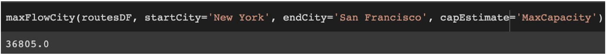
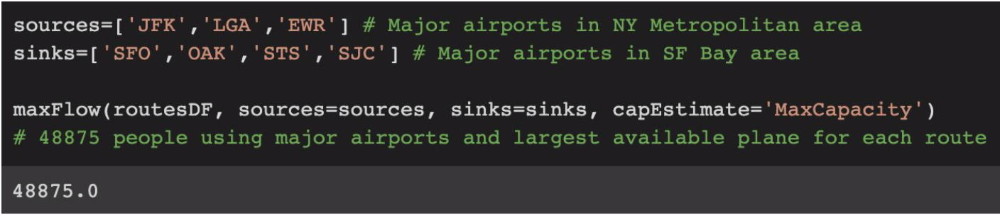
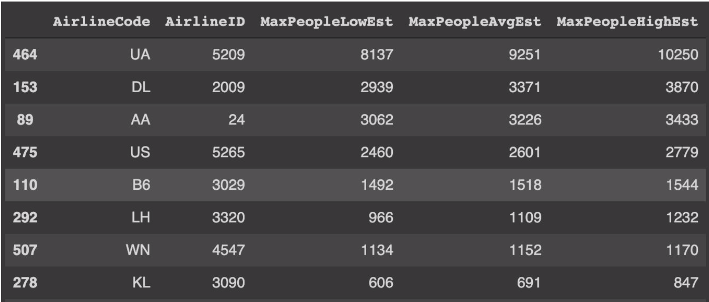

## flight_max_flow Algorithms Project

This repo contains Python code that serves as a solution to a specific maximum-flow problem.

The goal was to take in flight data (taken from https://openflights.org/data.html), a starting city or list of starting airports, and a destination city or list of destination airports, and output the max amount of people that may be flown from start to end without utilizing any flight more than once.

A detailed report can be found in the file report.pdf and the full Python notebook is in flight_max_flow.ipynb.

For a brief idea of the main function's use, however, here are a few screenshots of the final result. The user may enter the name of the starting city, destination city, and whether they want to use a lower upper or average estimate for plane size (considering plane capacities that are normally used on each flight) and it will output and estimate of the maximum number of people that may be transported using the flights available in the dataset:

The user may also enter the three-letter IATA codes for each starting and ending airport:

As an example to show the exploratory power of the functions, here is a data frame we generated to show which airline carriers can transport the most people from NY to SF:

We can see United Airlines (UA) can transport the most people.
